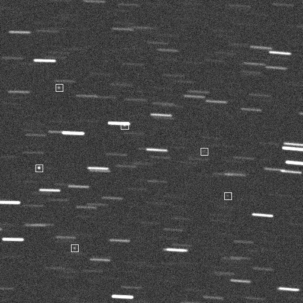

SatSim
======

**SatSim source code was developed under contract with AFRL/RDSM, and is approved for public release under Public Affairs release approval
#AFRL-2022-1116.**

SatSim is a high fidelity space surveillance optical scene simulation environment built on top of TensorFlow to utilize the speed of CUDA GPUs. SatSim is capable of generating synthetic observation data for SatNet, a deep learning platform for satellite object detection, and can provide users with nearly limitless labeled data. SatSim allows for systematic changes in the synthetic data, such as object brightness and star drift rate. The synthetic data is useful for training deep learning models. The synthetic data can also be used for model evaluation, characterizing performance metrics such as false alarm rate and minimum detectable target (MDT).

Documentation
-------------

* [Installation](docs/installation.rst)
* [Usage](docs/usage.rst)
* [Developers](CONTRIBUTING.rst#getting-started)

Versions
--------

* [History](HISTORY.md)