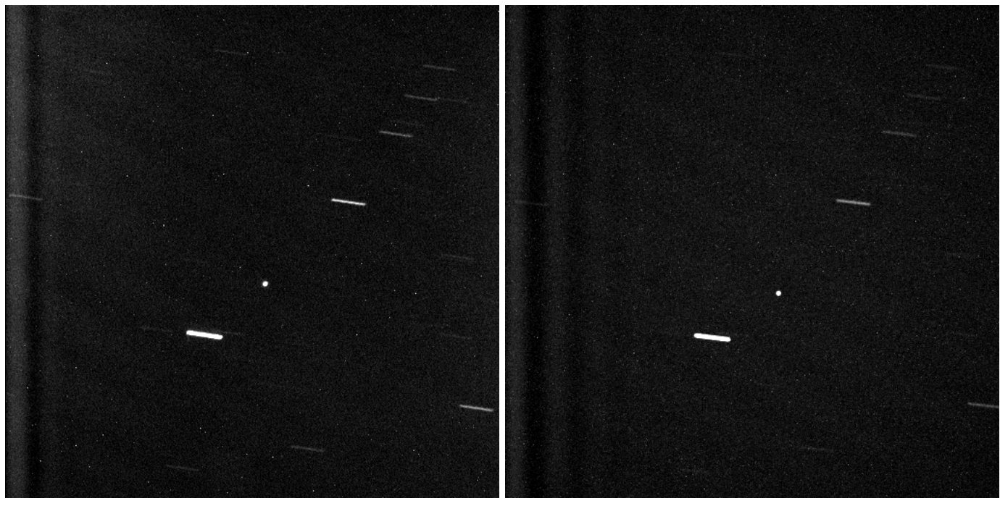
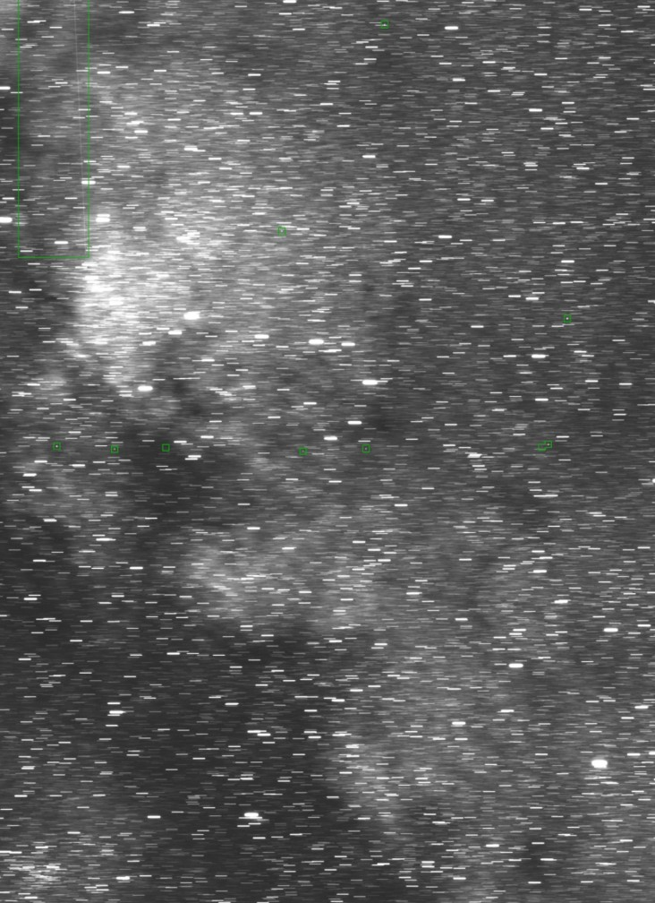

# SatSim

[](https://github.com/ssc-ai/satsim/actions/workflows/unit-tests.yml)

**SatSim source code was developed under contract with AFRL/RDSM, and is approved for public release under Public Affairs release approval #AFRL-2022-1116.**

SatSim is a GPU-accelerated synthetic data generation engine for space domain awareness scenes. It renders electro-optical imagery of resident space objects (RSOs), produces labels and metadata for detection workflows, and includes an analytical radar path for measurement simulation. Configurations are plain JSON or YAML, so a single scenario can be fixed, procedurally sampled, or generated from Python functions.


_Real Raven rate-track imagery and a SatSim-rendered counterpart, adapted from the public SatSim SPIE Defense + Commercial Sensing paper._



_Synthetic PANDORA wide-field imagery generated for sensor modeling, adapted from the same paper._


## What SatSim Does

- Renders stars, RSOs, point-spread functions, sky background, dark current, shot noise, read noise, pixel response, bias, and analog-to-digital conversion.
- Supports fast 2D image-plane targets and 3D astrometric geometry using TLE/SGP4, two-body state vectors, ephemerides, great-circle tracks, and angles-only observations.
- Models Gaussian and POPPY physical-optics PSFs, optional turbulence, tiled rendering for large images, FITS compression, segmentation masks, and ground-truth planes.
- Adds environmental effects including skyglow, moonlight, twilight, daytime sky brightness, and procedural cloud attenuation and glow.
- Generates nominal, RPO, breakup, collision, Monte Carlo, and sensor-variation scenarios through `$sample`, `$generator`, `$function`, `$pipeline`, `$compound`, `$ref`, and `$import`.
- Writes SatNet-style annotations, FITS image frames, annotated JPEGs, APNG movies, CZML visualizations, analytical EO observations, and radar observations.
- Can augment TensorFlow datasets by injecting synthetic targets into real imagery during training.

## Quick Start

Install the released package:

```bash
pip3 install satsim
```

Run an EO image simulation from a JSON or `.yml` configuration:

```bash
satsim --debug INFO run --device 0 --mode eager --output_dir output/ input/config.json
```

Use SatSim from Python:

```python
from satsim import gen_multi, load_json

ssp = load_json("input/config.json")
ssp["sim"]["samples"] = 50
ssp["geometry"]["obs"]["list"][0]["mv"] = 17.5

gen_multi(ssp, eager=True, output_dir="output/")
```

The CLI writes each run to a timestamped output directory. Typical EO products include `ImageFiles/*.fits`, `Annotations/*.json`, `AnnotatedImages/*.jpg`, optional segmentation TIFFs, optional ground-truth TIFF stacks, `movie.png`, `satsim.czml`, and transformed `config_pass_*.json` files.

## Documentation

- [Installation](docs/installation.md)
- [Usage](docs/usage.md)
- [JSON schema](schema/v1/README.md)
- [Developer setup](CONTRIBUTING.md#getting-started-for-developers)
- [Release history](HISTORY.md)
